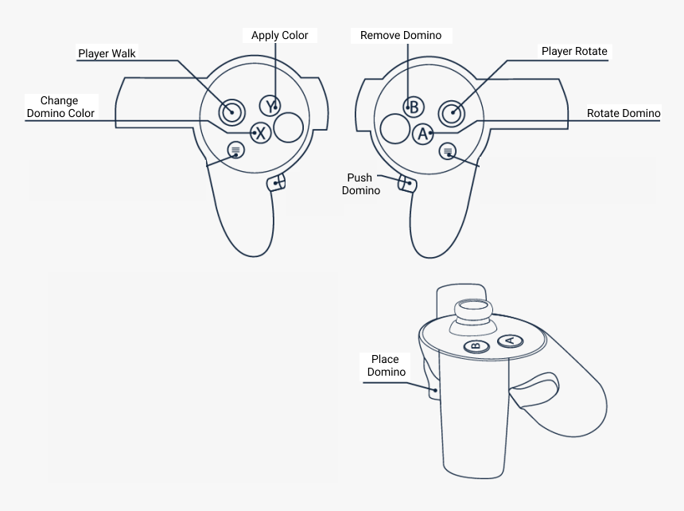
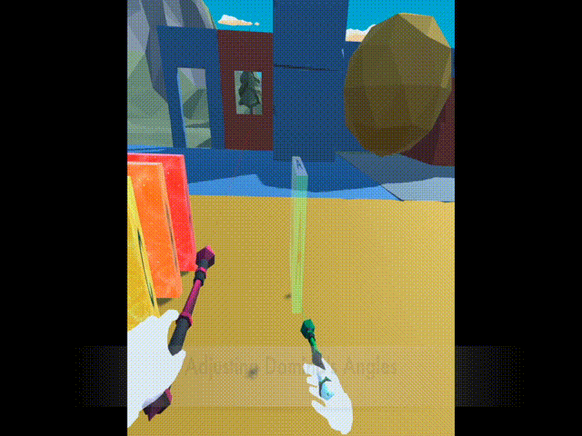
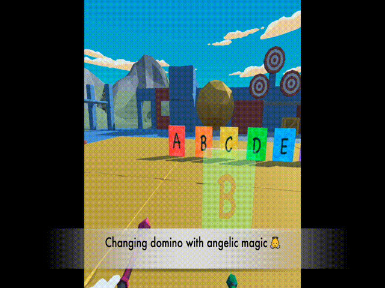

# VR-Musical-Domino

##### The app supports Oculus Quest. 

##### Follows the control layout below.

## Control Menu

1. [**Walking**: L thumbtack](#Placing Domino)
2. [**Rotating**: R thumbtack](#Rotating Domino)
3. **Placing Domino:** R Trigger
4. **Rotating Domino**: R Button A
5. **Deleting Domino**: R Button B
6. **Switching Domino Color**: L Button X
7. **Assigning Domino Color**: L Button Y
8. **Pushing Domino**: R Grip

## Demo

#### Placing Domino  

Click R Trigger while pointing to the ground

#### Rotating Domino  

Click R hand Button A

#### Assigning Color  

Click Button X to switch color, click Button Y to assign color to the domino pointing at.

#### Deleting Domino  

Point to a domino with left hand raycast, and click Button B to delete it 

#### Placing Domino Continuously   

Hold L Trigger while moving

#### Raising All Falled Dominoes Up   

Move to the center control station, and touch the green button with hand (not point with raycast, need to touch with right hand)

#### Clearing  Dominoes 

At the center control station, and touch the red button with right hand

#### Pushing  Domino 

Hold R Grip Button and push the domino forwards.

